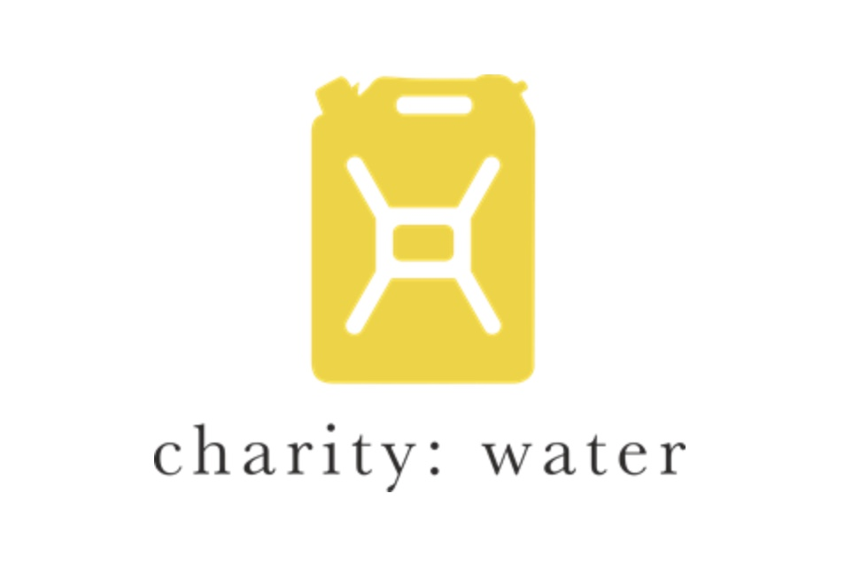

<!DOCTYPE html>
<html lang="en">
<head>
  <meta charset="UTF-8" />
  <meta name="viewport" content="width=device-width, initial-scale=1.0"/>
  <title>Charity: Water | Clean Water. Real Impact.</title>
  <link href="https://fonts.googleapis.com/css2?family=Poppins:wght@400;600;800&display=swap" rel="stylesheet">
  
</head>
<body>
  <nav>
    

      
    

    <button class="login-button">Log In</button>
  </nav>

  <header class="hero">
    

    

      <h1>Clean Water. Real Impact.</h1>
      
Donate $10, track the change. Give back with purpose—in seconds.

      

        <button class="info-button">See Where Your $10 Goes</button>
        <button class="cta-button">TAKE ACTION</button>
      

    

  </header>
</body>
</html>

